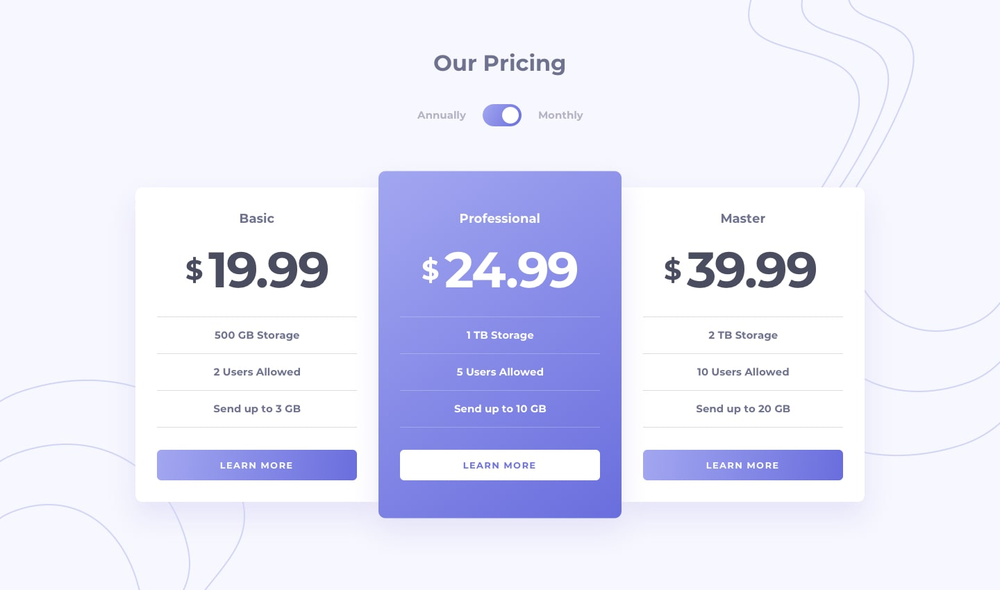

# Projet 1

Créer un projet **React JS avec Vite et Tailwind CSS**.
Intégrer la maquette donnée en suivant les directives de style ci-dessous.



## Colors

### Primary

- Primary: hsl(236, 72%, 79%)
- Secondary: hsl(237, 63%, 64%)

- Linear Gradient: hsl(236, 72%, 79%) to hsl(237, 63%, 64%)

### Neutral

- Very Light Grayish Blue: hsl(240, 78%, 98%)
- Light Grayish Blue: hsl(234, 14%, 74%)
- Grayish Blue: hsl(233, 13%, 49%)
- Dark Grayish Blue: hsl(232, 13%, 33%)

## Typography

### Body Copy

- Font size: 15px

### Font

- Family: [Montserrat](https://fonts.google.com/specimen/Montserrat)
- Weight: 700

## Contenu

```Plaintext
Basic
19.99,
500 GB Storage
2 Users Allowed
Send up to 3 GB
199.99

Professional
24.99
1 TB Storage
5 Users Allowed
Send up to 10 GB
249.99

Master
39.99
2 TB Storage
10 Users Allowed
Send up to 20 GB
399.99
```
